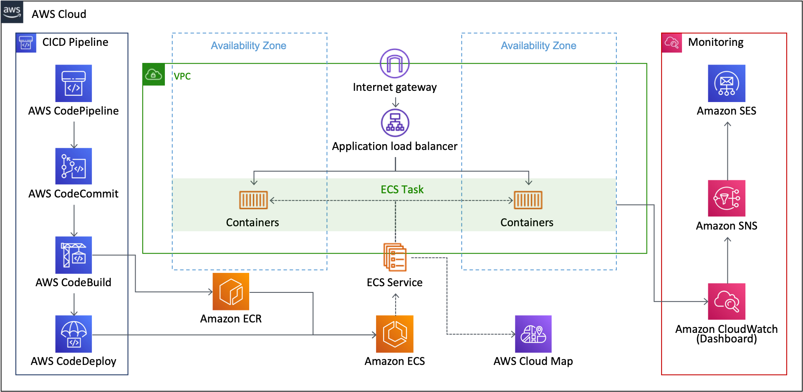

# SEON CDK

## Architecture

- **Container-based MSA**: Each micro-services are implemented using AWS ECS(Cluster/Service/Task)
- **Programming-based IaC**: All cloud resources are modeld and provisioned using AWS CDK(Typescript)
- **Fully managed CICD**: Continuous integration and continuous deploy (Pipeline/GitHub/Build/Deploy)
- **Fully managed Monitoring**: Logging, metric, dashboard using Amazon CloudWatch
- **Service Discovery**: Private DNS service registration & discovery using AWS Cloud Map

